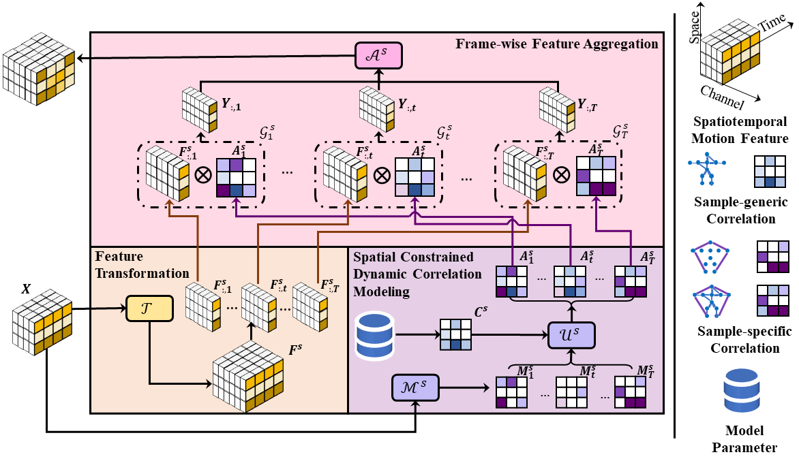

# DSTD-GCN

This is the official pytorch implementation of [DSTD-GCN](https://ieeexplore.ieee.org/document/10138910).

This paper is accepted by IEEE Transactions on Neural Networks and Learning Systems.

## Overview

<p align="center">

</p>

Human motion prediction is challenging due to the complex spatiotemporal feature modeling. Among all methods, graph convolution networks (GCNs) are extensively utilized because of their superiority in explicit connection modeling. Within a GCN, the graph correlation adjacency matrix drives feature aggregation, and thus, is the key to extracting predictive motion features. State-of-the-art methods decompose the spatiotemporal correlation into spatial correlations for each frame and temporal correlations for each joint. Directly parameterizing these correlations introduces redundant parameters to represent common relations shared by all frames and all joints. Besides, the spatiotemporal graph adjacency matrix is the same for different motion samples, and thus, cannot reflect samplewise correspondence variances. To overcome these two bottlenecks, we propose dynamic spatiotemporal decompose GC (DSTD-GC), which only takes 28.6% parameters of the state-of-the-art GC. The key of DSTD-GC is constrained dynamic correlation modeling, which explicitly parameterizes the common static constraints as a spatial/temporal vanilla adjacency matrix shared by all frames/joints and dynamically extracts correspondence variances for each frame/joint with an adjustment modeling function. For each sample, the common constrained adjacency matrices are fixed to represent generic motion patterns, while the extracted variances complete the matrices with specific pattern adjustments. Meanwhile, we mathematically reformulate GCs on spatiotemporal graphs into a unified form and find that DSTD-GC relaxes certain constraints of other GC, which contributes to a better representation capability. Moreover, by combining DSTD-GC with prior knowledge like body connection and temporal context, we propose a powerful spatiotemporal GCN called DSTD-GCN. On the Human3.6M, Carnegie Mellon University (3dpw) Mocap, and 3D Poses in the Wild (3DPW) datasets, DSTD-GCN outperforms state-of-the-art methods by 3.9%–8.7% in prediction accuracy with 55.0%–96.9% fewer parameters.

## Setup

<details>
<summary>
Setup Python develop environment.
</summary>

```bash
# We recommand conda virtual environment.
conda create -n dstdgcn

# Install pytorch based on the local machine.
# NOTE: this is only for reference.
conda install pytorch==1.10.0 torchvision==0.11.0 torchaudio==0.10.0 cudatoolkit=11.3 -c pytorch -c conda-forge

# Install necessary environment.
pip install -r requirements.txt
```

As a reference, we present our virtual environment list as `condalist.txt`.

</details>

<details>
<summary>
Prepare datasets.
</summary>

There are three datasets. Please make a new directory `data` under the project root and place each data set as a folder under the dataset.

As a reference, the folder structure should look like:

```bash
├── data
    ├── cmu        # CMU Mocap
    ├── h36m       # Human3.6M
    └── 3dpw       # 3DPW
```

[Human3.6m](http://vision.imar.ro/human3.6m/description.php) in exponential map can be downloaded from [here](http://www.cs.stanford.edu/people/ashesh/h3.6m.zip).

[CMU Mocap](http://mocap.cs.cmu.edu/) was obtained from the [repo](https://github.com/chaneyddtt/Convolutional-Sequence-to-Sequence-Model-for-Human-Dynamics) of ConvSeq2Seq paper.

[3DPW](https://virtualhumans.mpi-inf.mpg.de/3DPW/) from their official website.

</details>

## Training & Evaluation

For all the training and evaluation codes, we provide scripts below. Besides, you can also find running scripts under `scripts/`.

<details>
<summary>
Human3.6M
</summary>

```bash
# This scripts can be found in `scripts/dstdgcn_h36m.sh`
export CUDA_VISIBLE_DEVICES=0

# Variables
time=$(date "+%Y%m%d")
exp_name=${time}_"dstdgcn_h36m"   # Specify your own experiment name.
save_dir="runs/"$exp_name

# Check save directory
if [ ! -d ${save_dir} ]; then
    mkdir -p ${save_dir}
fi

# Scripts
# Training
python main.py --exp_name ${exp_name} --run_dir ${save_dir} --config configs/dstdgcn/dstdgcn_h36m.yaml

# Testing
# By default, it will load the pretrained checkpoint
# For your own checkpoint, you should change `ckpt` in the config file
python main.py --exp_name ${exp_name} --run_dir ${save_dir} --config configs/dstdgcn/dstdgcn_h36m_test.yaml
```

</details>

<details>
<summary>
CMU Mocap
</summary>

```bash
# This scripts can be found in `scripts/dstdgcn_3dpw.sh`
export CUDA_VISIBLE_DEVICES=0

# Variables
time=$(date "+%Y%m%d")
exp_name=${time}_"dstdgcn_cmu"  # Specify your own experiment name.
save_dir="runs/"$exp_name

# Check save directory
if [ ! -d ${save_dir} ]; then
    mkdir -p ${save_dir}
fi

# Scripts
# Training
python main.py --exp_name ${exp_name} --run_dir ${save_dir} --config configs/dstdgcn/dstdgcn_cmu.yaml

# Testing
# By default, it will load the pretrained checkpoint
# For your own checkpoint, you should change `ckpt` in the config file
python main.py --exp_name ${exp_name} --run_dir ${save_dir} --config configs/dstdgcn/dstdgcn_cmu_test.yaml
```

</details>

<details>
<summary>
3DPW
</summary>

```bash
# This scripts can be found in `scripts/dstdgcn_3dpw.sh`
export CUDA_VISIBLE_DEVICES=0

# Variables
time=$(date "+%Y%m%d")
exp_name=${time}_"dstdgcn_3dpw"  # Specify your own experiment name
save_dir="runs/"$exp_name

# Check save directory
if [ ! -d ${save_dir} ]; then
    mkdir -p ${save_dir}
fi

# Scripts
# Training
python main.py --exp_name ${exp_name} --run_dir ${save_dir} --config configs/dstdgcn/dstdgcn_3dpw.yaml

# Testing
# By default, it will load the pretrained checkpoint
# For your own checkpoint, you should change `ckpt` in the config file
python main.py --exp_name ${exp_name} --run_dir ${save_dir} --config configs/dstdgcn/dstdgcn_3dpw_test.yaml
```

</details>

We also provide pretrained model checkpoints, which can be downloaded from [Google Drive](https://drive.google.com/drive/folders/15tslitKrNVPmmfWekPQbz8Vr--i1QS_J?usp=sharing) or [Baidu Netdisk (extraction code: dstd)](https://pan.baidu.com/s/1DBPFgDx-fKheNs1T-GZTZw?pwd=dstd). Please download the checkpoints and place it under `milestone/`.

通过网盘分享的文件：3dpw.pth等3个文件
链接:  提取码: dstd

## Cutomization

You can also develop your own method or set up your own dataset in this project.

<details>
<summary>
Customize your own model.
</summary>

The first step is to setup your own dataset file under `model/`. Create an dataset python class scripts. You can check example data files under the `model`/. You can customize the variable for the class constructor. You can define the model layers under `model/layers/` Don't forget to add reference in `model/__init__.py`.

The final step is to customize the configuration file under `config/`. You need to change the `model` items. The `name` value should map the key in in `model/__init__.py`. The configuration under the model name should match the variable in the model constructor function. We provide an annotated examples as `config/dstdgcn/dstdgcn_h36m.yaml`.

</details>

<details>
<summary>
Customize your own dataset.
</summary>

The first step is to setup your own dataset file under `dataset/`. Create an dataset python class scripts. You can check example data files under the `dataset/`. You can customize the variable for the class constructor. Don't forget to add reference in `dataset/__init__.py`.

The next step is to customize the runner. You can check scripts under `runner/` for reference. Your own runner should inherit the `BaseRunner`. Specifically, you need to specify two functions `run_train` and `run_test`. This function defines what the runner actually do for each epoch.

The final step is to customize the configuration file under `config/`. There are three items you need to set:

1. The `dataset` contains basic options for the dataset. You need to define both training and test (validation) options. The `name` value should corresponds to key under `train` and `test`. The configuration under the dataset name should match the variable in the model constructor function. Also, the `name` value should map the key in in `dataset/__init__.py`;
2. The `setting` contains dataset settings. Here you need to specify the model as well as frame index for evaluation, used dimension, and padding joints.
3. The `model` contains model configuration, you may need to change it according to your dataset. The `name` value should map the key in in `model/__init__.py`; We provide an annotated examples as `config/dstdgcn_h36m.py`.

</details>

## TODOS

- [x] Model checkpoints
- [x] Customization codes

## Citation

If you find this project contributes to your work, please cite the following paper.

```
@article{fu2023dstdgcn,
  author={Fu, Jiajun and Yang, Fuxing and Dang, Yonghao and Liu, Xiaoli and Yin, Jianqin},
  journal={IEEE Transactions on Neural Networks and Learning Systems},
  title={Learning Constrained Dynamic Correlations in Spatiotemporal Graphs for Motion Prediction},
  year={2024},
  doi={10.1109/TNNLS.2023.3277476},
  volume={35},
  number={10},
  pages={14273-14287}
}
```

## Acknowledgements

Some of the codes are from [STS-GCN](https://github.com/FraLuca/STSGCN), [LearnTrajDep](https://github.com/wei-mao-2019/LearnTrajDep) and [MSR-GCN](https://github.com/Droliven/MSRGCN). Besides, this project is developed based on the [template](https://github.com/L1aoXingyu/Deep-Learning-Project-Template). We really thank the authors for their wonderful works.
